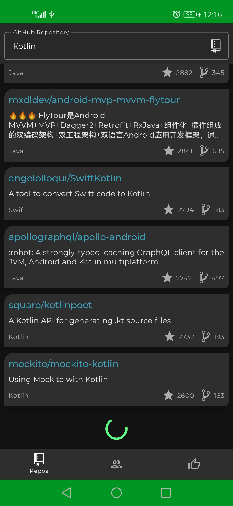
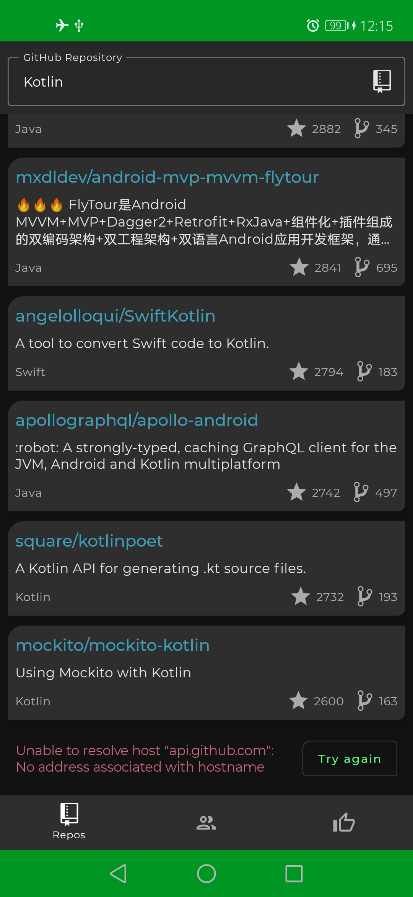

# GithubViewer
Simple app in Jetpack Compose which allows searching repos and users on GitHub. Repositories can be saved locally. Based on Google paging-3-sample

### Searching repositories by name: 
</img>
</img>

### Searching users by username: 
</img>
</img>

### Liked (saved locally) users and repositories: 
</img>
</img>

### App when there is no internet connection or new repositories are loaded: 
</img>
</img>
